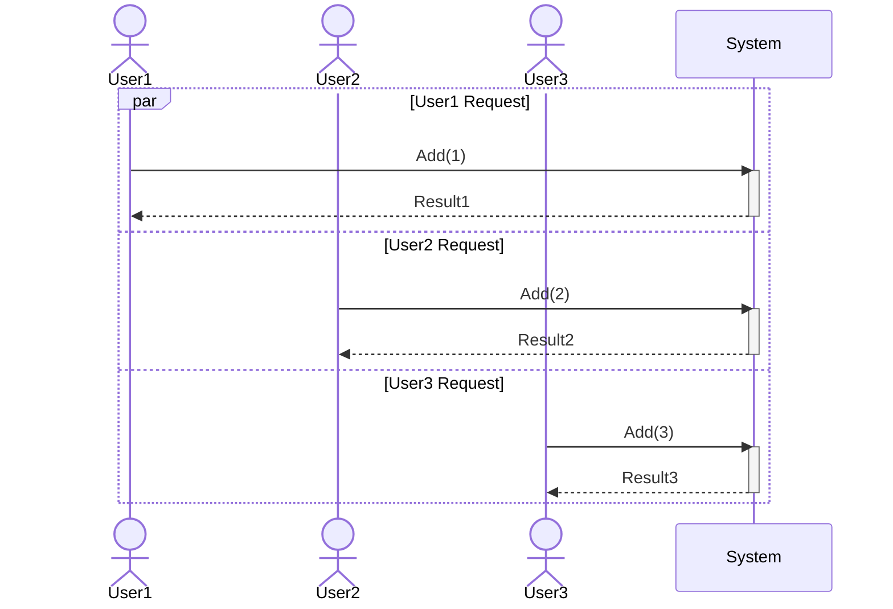
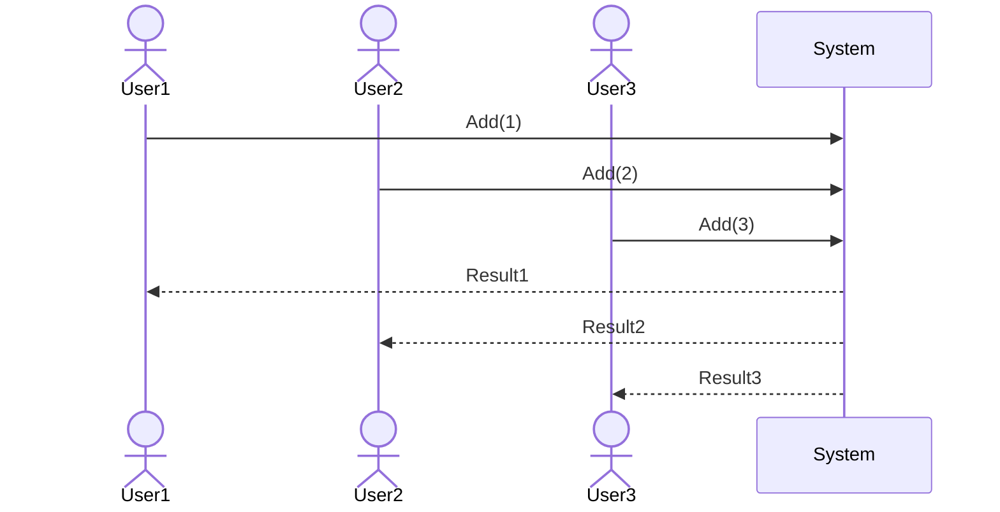
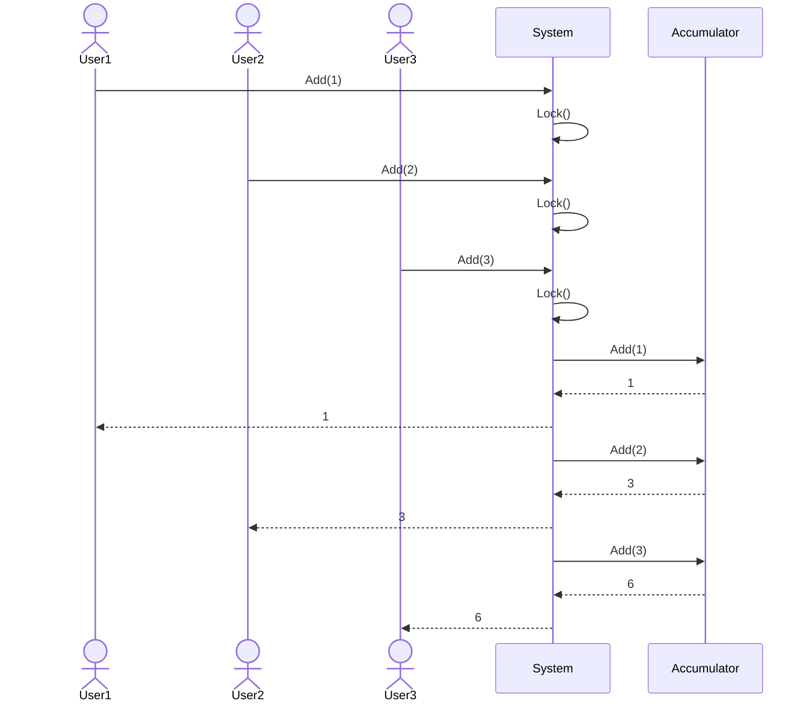
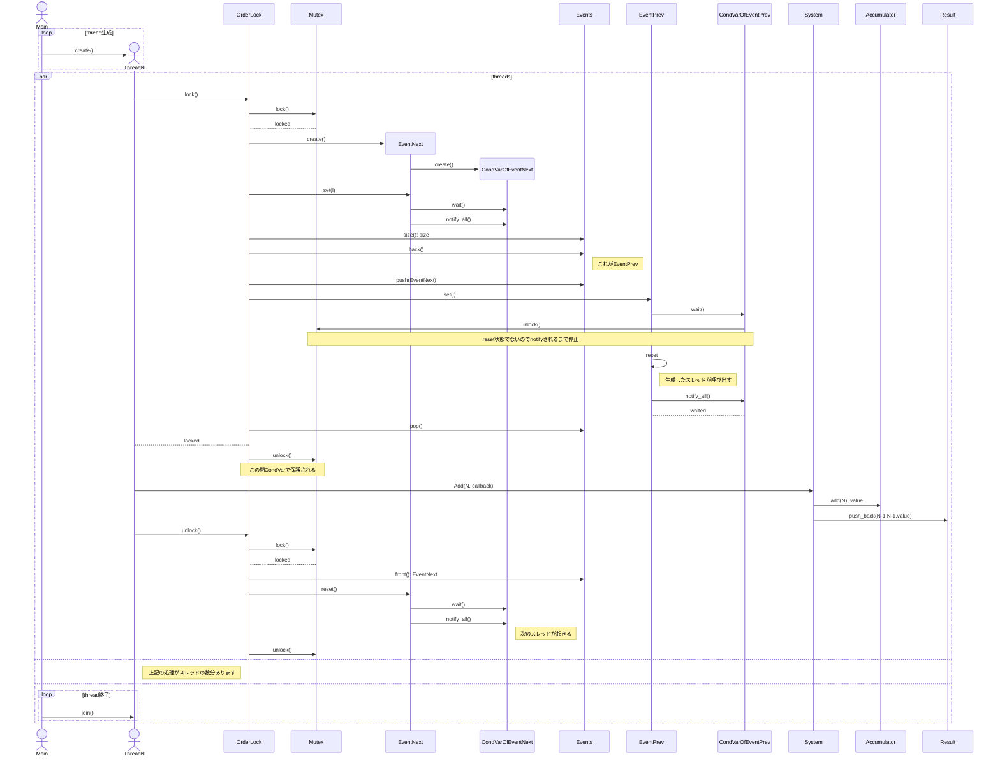
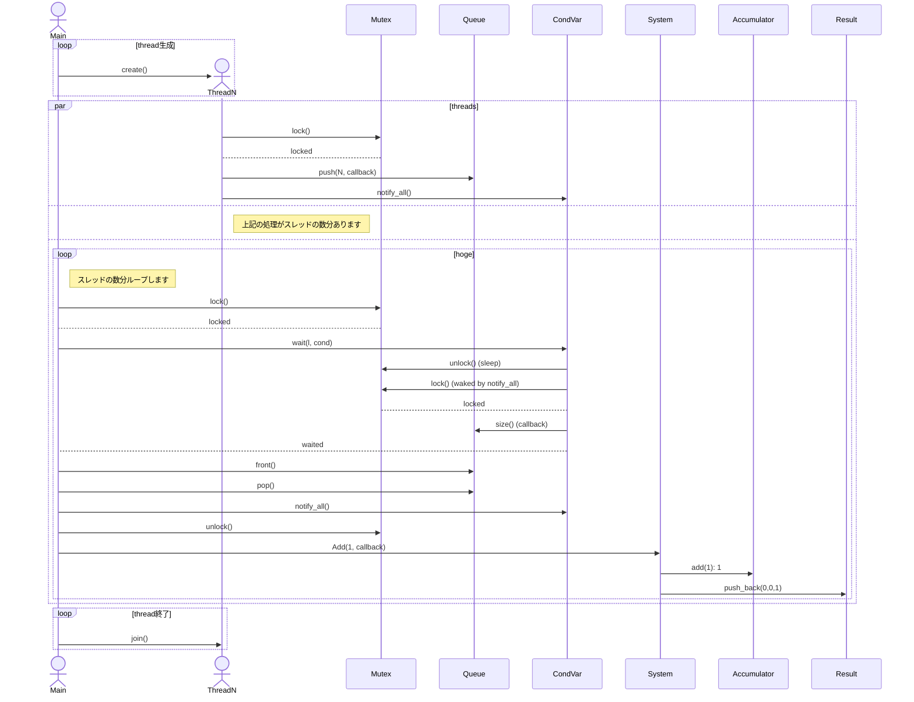

# 序

複数のスレッドからリクエストが来る状況ってよくありますが、それをどう処理するか？という話です。

例えばユーザーから数字を1つ受け取り、その数字の回数だけ乱数生成してシステムで1つの数字(初期値は0)に足してそれを返すとします。そのリクエストが何番目のリクエスト(0始まり)かも同時に返して、順序が分かるようにします。

UMLでは模式的にこう描いて、par(=parallel)内が並列なので、上の箱と真ん中の箱と下の箱は実際には重なります、みたいな意味になるのですが…



分かりにくいのでこう描いて順序を分かるようにします。



activationは入れ子しか描けないので描きません。こんなリクエストならUser2やUser3のRequestは一旦ブロックされて、User1にレスポンスを返ってからUser2がロックを取得でき、そこから処理を始めて終わったらUser2にレスポンスを返し、User3が…みたいな処理になるでしょう。

これをそのまま描くと以下のような処理になるでしょう。



なんか出来そうですね。しかしここで問題があります。実はロックを取得できる順番がUser1, User2, User3の順ではなく、User1, User3, User2の順かもしれないという話です。特にロックが長時間に渡る場合、そして多数のスレッドがロックをリクエストした場合、リクエストした順に確保できるかの保証がないということです。

今回はこれをテーマに色々C++で実験してみます。

# mutexを複数のスレッドからロックして順番を見る

ロック直前に時間を取得して、そこからロックを取得して得られた順番を見てみます。

## コード

```c++:locktimeid.cpp
#include <iostream>
#include <thread>
#include <mutex>
#include <chrono>
#include <vector>
#include <atomic>
#include <memory>
#include <iomanip>

using namespace std;
using namespace std::chrono;

struct idtime {
    size_t i;
    uint64_t id;
    high_resolution_clock::time_point t;
};

vector<idtime> test(size_t N) {
    vector<unique_ptr<thread>> threads(0);
    mutex m;
    atomic_uint64_t current_id = 0;

    vector<idtime> data_vec;
    for (size_t i = 0; i < N; ++i) {
        threads.emplace_back(
            make_unique<thread>([&, i] {
                auto t = high_resolution_clock::now();
                unique_lock<mutex> l(m);
                size_t myid = current_id++;
                data_vec.emplace_back(idtime{i, myid, t});
                if (myid == 0) this_thread::sleep_for(3s);
            })
        );
    }

    for (auto& t : threads) t->join();
    return data_vec;
}

int main() {
    constexpr size_t N = 5000;
    bool exist_diff = false;
    vector<idtime> data_vec;
    auto t0 = high_resolution_clock::now();
    auto prev = t0;
    for (size_t i = 0; ! exist_diff; ++i) {
        cerr << i << "th time testing ... " << endl;
        prev = t0 = high_resolution_clock::now();
        data_vec = test(N);
        for (auto& d: data_vec) {
            if (prev >= d.t) {
                exist_diff = true;
            }
            prev = d.t;
        }
    }
    prev = t0;
    for (auto& d: data_vec) {
        cout << d.i << "\t" << d.id << "\t" << setprecision(10) << duration_cast<nanoseconds>(d.t - t0).count() / 1000000000. << endl;
        if (prev >= d.t) {
            cerr << "[not ordered]" << d.i << "\t" << d.id << "\t" << setprecision(10) << duration_cast<nanoseconds>(d.t - t0).count() / 1000000000. << endl;
        }
        prev = d.t;
    }

    return 0;
}
```

## 出力

```console
$ g++ -g -O3 locktimeid.cpp -o locktimeid
$ ./locktimeid >locktimeid.log
0th time testing ... 
1th time testing ... 
2th time testing ... 
3th time testing ... 
4th time testing ... 
5th time testing ... 
6th time testing ... 
7th time testing ... 
8th time testing ... 
[not ordered]624	625	0.025535122
$ sed -n '625,626p' locktimeid.log
625	624	0.025535813
624	625	0.025535122
$
```
このプログラムではtest関数1回で5000個のスレッドをlockさせて、IDや時間などのデータを取得しています。その後、時間が逆順になっている行を探して存在しなければ再度test関数を呼び出すループする感じです。逆順が見つかると標準出力に5000スレッド分のデータを出力し、逆順のデータをエラー出力に吐いています。吐かれたデータから行数を割り出して、sedで抽出した結果、確かに微妙に逆順であることが分かります。

上記はLinuxでの実行結果ですが、Windowsでも確率的にも時間差的にも似たような数字でした。

## 考察

意外なほどスレッドはFIFOで起きており。逆順の確率はたったの1/50000でした。しかも僅かな時間差(700ns程度)であり、誤差と言っていいでしょう。

ただし、

https://learn.microsoft.com/ja-jp/windows/win32/sync/mutex-objects

にも

> ミューテックスで複数のスレッドが待機している場合は、待機中のスレッドが選択されます。 先入れ先出し (FIFO) の順序は想定しないでください。 カーネル モードの APC などの外部イベントは、待機順序を変更できます。

とあるとおり、仕様上は想定してはいけません[^1]。

また、

https://stackoverflow.com/questions/1545129/order-of-execution-of-waiting-threads-blocked-by-mutex

などで

> FIFO signaling leads to lock convoys. On newer versions of the Win32 API the convoy issue is addressed by macking mutexes and other synchrnonization primitives explicitly unfair (ie. no FIFO).
>
> >    If more than one thread is waiting on a mutex, a waiting thread is selected. Do not assume a first-in, first-out (FIFO) order. External events such as kernel-mode APCs can change the wait order.

と話されているとおり、

https://en.wikipedia.org/wiki/Lock_convoy

の回避にも一役買っているらしいです。

## ここまでのまとめ

現実にはほとんどロックをリクエストした順番にロックを取得できていますが、仕様上はそう仮定してはいけなくて、むしろそうなりすぎるとかえって危険との話がありました。

# 複数スレッドからリクエストを受けた場合どうするか？

素直に考えると、

- リクエスト順にロックを取得させてそのスレッドに処理させる

になります。こうした場合、処理が終わるまで別のスレッドは待たされます。これは序章で説明した絵のとおりの形ですが、そこに順序保証を付けるやり方です。同期リソースを大量に使う割に、結局一度に1つしか動かせず、コスパは悪いかもしれません。

もう1つの方法は、

- リクエストされたこと自体を一旦そのままキューに詰み、別のスレッドからキューを読み出し、逐次処理させる

になります。一般的にはこちらが多いと思います。ただし、方式的にはどちらもセマフォのような条件を加えることにより並列化も可能です。そこはただの応用なので、今回は並列化まではしません。

以降この2つの方法を実装してみます。

## リクエスト順にロックを取得させてそのスレッドに処理させる

### イメージ


activationがないので見にくいのですが、Qiitaは文字数制限が厳しすぎて入りませんでした。

### 順序保証ロックの実装

```c++
#include <iostream>
#include <thread>
#include <mutex>
#include <condition_variable>
#include <queue>
#include <memory>
#include <atomic>
#include <functional>
#include <random>

using namespace std;

struct event {
    bool state;
    condition_variable cond;
    event() : state(false) {}
    event(const event&) = delete;
    event(event&&) = delete;
    event& operator=(const event&) = delete;
    event& operator=(event&&) = delete;
    template <typename T>
    void set(T& l) {
        this->cond.wait(l, [=] {return !this->state; });
        this->state = true;
        this->cond.notify_all();
    }
    template <typename T>
    void reset(T& l) {
        this->cond.wait(l, [=] {return this->state; });
        this->state = false;
        this->cond.notify_all();
    }
};

struct order_lock {
    size_t max_lock_size = 0;
    mutex m;
    queue<shared_ptr<event>> events;
    void lock() {
        unique_lock<mutex> l(this->m);
        shared_ptr<event> prev_event, next_event = make_shared<event>();
        next_event->set(l);
        if (this->events.size() > 0)
        {
            prev_event = this->events.back();
        }
        this->events.push(next_event);
        if (this->events.size() > this->max_lock_size) this->max_lock_size = this->events.size();
        if (prev_event) {
            prev_event->set(l);
            if (this->events.front().get() == prev_event.get()) {
                this->events.pop();
            }
            else {
                throw "おかしい！";
            }
        }
    }
    void unlock() {
        unique_lock<mutex> l(this->m);
        if (this->events.size() > 0)
        {
            this->events.front()->reset(l);
        }
    }
};

struct accumulator {
    uint64_t value = 0;
    uint64_t add(uint64_t x) {
        // あえてシードは与えない
        mt19937 gen;
        for (uint64_t i = 0; i < x; ++i) {
            value += gen();
        }
        return value;
    }
};

struct my_system {
    uint64_t current_id;
    struct result {
        uint64_t id;
        uint64_t value;
    };
    accumulator acc;
    my_system() : current_id(0) {}
    void add(uint64_t x, function<void(const result&)> func) {
        result r{ current_id++, acc.add(x) };
        func(r);
    }
};

struct test_result {
    uint64_t id_diff_count = 0;
    size_t max_lock_size = 0;
    size_t max_queue_size = 0;
    double second = 0.;
};

test_result test(size_t N) {
    using namespace std::chrono;
    auto start_time = high_resolution_clock::now();
    auto get_time = [&] {
        auto end_time = high_resolution_clock::now();
        return duration_cast<milliseconds>(end_time - start_time).count() / 1000.;
    };
    vector<unique_ptr<thread>> threads(0);
    my_system sys;
    atomic_uint64_t count = 0;
    order_lock ol;
    vector<pair<uint64_t, my_system::result>> results;
    for (size_t i = 0; i < N; ++i) {
        threads.emplace_back(
            make_unique<thread>([&] {
                ol.lock();
                uint64_t id = count++;
                sys.add(id + 1, [&](const my_system::result& r) {
                    results.push_back(make_pair(id, r));
                });
                ol.unlock();
            })
        );
    }
    for (auto& pt : threads) {
        pt->join();
    }
    mt19937 gen;
    uint64_t sum = 0;
    uint64_t sumofsum = 0;
    test_result result;
    for (const auto& r : results) {
        sum += gen();
        sumofsum += sum;
        result.id_diff_count += (r.first != r.second.id);
        if (sumofsum != r.second.value) {
            cerr << r.first << "," << r.second.id << "," << r.second.value << "," << sum << endl;
        }
    }
    result.max_lock_size = ol.max_lock_size;
    result.second = get_time();
    return result;
}

int main() {
    cout << "method,N,second,id diff count,max lock size,max queue size" << endl;
    constexpr size_t REPEAT = 5;
    constexpr size_t N_UNIT = 5000;
    constexpr size_t N_COUNT = 6;
    for (size_t N = N_UNIT; N <= N_UNIT * N_COUNT; N += N_UNIT) {
        for (size_t i = 0; i < REPEAT; ++i) {
            auto result = test(N);
            cout  << "orderlock," << N << "," << result.second << "," << result.id_diff_count << "," << result.max_lock_size << "," << result.max_queue_size << endl;
        }
    }
    return 0;
}
```

Windowsに古くからある同期機構であるEventのような機能をstd::condition_variableで実装し(event)、それをキューに仕込んでロックするスレッドを数珠繋ぎに出来るようにしたorder_lockを実装してみました。

~~そもそもEventを直に使えてないのでWindowsでは不利だし~~[^2]、キューを使ってる時点でもうロックに拘る意味ないよねと思うのですが、まあそういう仕様だと思えばやむなしです。

mainでは5000x(1〜6)個のスレッドをキックして数珠繋ぎにしたEventをロックをさせて順番を確認しつつ時間を計測しています。

```console
$ ./acc_with_orderlock | tee acc_with_orderlock_opt.csv
method,N,second,id diff count,max lock size,max queue size
orderlock,5000,0.271,0,11,0
orderlock,5000,0.263,0,16,0
orderlock,5000,0.275,0,25,0
orderlock,5000,0.291,0,10,0
orderlock,5000,0.259,0,19,0
orderlock,10000,0.639,0,334,0
orderlock,10000,0.608,0,517,0
orderlock,10000,0.598,0,551,0
orderlock,10000,0.611,0,600,0
orderlock,10000,0.625,0,365,0
orderlock,15000,1.063,0,2329,0
orderlock,15000,1.071,0,1635,0
orderlock,15000,1.056,0,2220,0
orderlock,15000,1.06,0,1666,0
orderlock,15000,1.061,0,2206,0
orderlock,20000,1.795,0,4839,0
orderlock,20000,1.751,0,5210,0
orderlock,20000,1.741,0,4557,0
orderlock,20000,1.866,0,4768,0
orderlock,20000,1.736,0,4649,0
orderlock,25000,2.828,0,8073,0
orderlock,25000,2.914,0,7617,0
orderlock,25000,3.036,0,7685,0
orderlock,25000,2.885,0,7768,0
orderlock,25000,2.677,0,7874,0
orderlock,30000,3.941,0,11114,0
orderlock,30000,4.936,0,11049,0
orderlock,30000,3.753,0,11128,0
orderlock,30000,3.693,0,10680,0
orderlock,30000,4.053,0,11635,0
$
```

出力の4カラム目は順序の確認で、間違いは起きていないことがわかります。5カラム目は数珠繋ぎになったイベントの最大数、つまりorder_lockに対するlock()～unlock()までの処理が最大その数まで重なったということです。実際に処理しているのは最初のやつだけで、他はlock()メソッドから戻れていません。

## 別のスレッドからキューを読み出し、逐次処理

ようやく2つ目の方法です。

### イメージ


### 実装

```c++
#include <iostream>
#include <thread>
#include <mutex>
#include <condition_variable>
#include <queue>
#include <memory>
#include <atomic>
#include <functional>
#include <random>

using namespace std;

struct accumulator {
    uint64_t value = 0;
    uint64_t add(uint64_t x) {
        // あえてシードは与えない
        mt19937 gen;
        for (uint64_t i = 0; i < x; ++i) {
            value += gen();
        }
        return value;
    }
};

struct my_system {
    uint64_t current_id;
    struct result {
        uint64_t id;
        uint64_t value;
    };
    accumulator acc;
    my_system() : current_id(0) {}
    void add(uint64_t x, function<void(const result&)> func) {
        result r{ current_id++, acc.add(x) };
        func(r);
    }
};

struct test_result {
    uint64_t id_diff_count = 0;
    size_t max_lock_size = 0;
    size_t max_queue_size = 0;
    double second = 0.;
};

test_result test(size_t N) {
    using namespace std::chrono;
    auto start_time = high_resolution_clock::now();
    auto get_time = [&] {
        auto end_time = high_resolution_clock::now();
        return duration_cast<milliseconds>(end_time - start_time).count() / 1000.;
    };
    mutex m;
    condition_variable cv;
    queue<uint64_t> q;
    vector<unique_ptr<thread>> threads(0);
    my_system sys;
    atomic_uint64_t count = 0;
    vector<pair<uint64_t, my_system::result>> results;
    test_result result;
    for (size_t i = 0; i < N; ++i) {
        threads.emplace_back(
            make_unique<thread>([&] {
                unique_lock<mutex> l(m);
                uint64_t id = count++;
                q.push(id);
                cv.notify_all();
                })
        );
    }
    size_t max_queue_size = 0;
    while (results.size() < N) {
        unique_lock<mutex> l(m);
        cv.wait(l, [&] {return q.size() > 0; });
        if (result.max_queue_size < q.size()) result.max_queue_size = q.size();
        auto id = q.front();
        q.pop();
        cv.notify_all();
        l.unlock();
        sys.add(id + 1, [&](const my_system::result& r) {
            results.push_back(make_pair(id, r));
        });
    }
    for (auto& pt : threads) {
        pt->join();
    }
    mt19937 gen;
    uint64_t sum = 0;
    uint64_t sumofsum = 0;
    for (const auto& r : results) {
        sum += gen();
        sumofsum += sum;
        result.id_diff_count += (r.first != r.second.id);
        if (sumofsum != r.second.value) {
            cerr << r.first << "," << r.second.id << "," << r.second.value << "," << sum << endl;
        }
    }
    result.second = get_time();

    return result;
}

int main() {
    cout << "method,N,second,id diff count,max lock size,max queue size" << endl;
    constexpr size_t REPEAT = 5;
    constexpr size_t N_UNIT = 5000;
    constexpr size_t N_COUNT = 6;
    for (size_t N = N_UNIT; N <= N_UNIT * N_COUNT; N += N_UNIT) {
        for (size_t i = 0; i < REPEAT; ++i) {
            auto result = test(N);
            cout  << "queue," << N << "," << result.second << "," << result.id_diff_count << "," << result.max_lock_size << "," << result.max_queue_size << endl;
        }
    }
    return 0;
}
```
主にロックされるのはqueueだけになり、同期周りがかなりスッキリしました。queueingした後はメインスレッドで普通に逐次処理しています。
```console
$ ./acc_with_simpleq | tee acc_with_simpleq_opt.csv
method,N,second,id diff count,max lock size,max queue size
queue,5000,0.312,0,0,4999
queue,5000,0.297,0,0,4999
queue,5000,0.303,0,0,4999
queue,5000,0.302,0,0,4999
queue,5000,0.307,0,0,4999
queue,10000,0.741,0,0,9999
queue,10000,0.742,0,0,9999
queue,10000,0.751,0,0,9999
queue,10000,0.74,0,0,9999
queue,10000,0.738,0,0,9999
queue,15000,1.338,0,0,14999
queue,15000,1.349,0,0,14999
queue,15000,1.377,0,0,14999
queue,15000,1.318,0,0,14999
queue,15000,1.321,0,0,14999
queue,20000,2.055,0,0,19999
queue,20000,2.071,0,0,19999
queue,20000,2.064,0,0,19999
queue,20000,2.07,0,0,19999
queue,20000,2.037,0,0,19999
queue,25000,2.95,0,0,24999
queue,25000,2.922,0,0,24999
queue,25000,2.922,0,0,24999
queue,25000,2.944,0,0,24999
queue,25000,2.921,0,0,24999
queue,30000,4.013,0,0,29999
queue,30000,3.999,0,0,29999
queue,30000,3.957,0,0,29999
queue,30000,4.026,0,0,29999
queue,30000,3.995,0,0,29999
$
```
最初の方式と比較してあまり差がないですね。こちらも順序保証に問題はなく、ほぼ全てのスレッドからのリクエストがキューイングされた状態になっていたことがわかります。mutex/condition_variableにより実際に停止していたスレッドはほぼなかったのかもしれません。

## 速度計測

先の結果をプロットしたものです。

### Ubuntu 22.04

コンパイルはg++ -g -O3とかでしています。


時間測定の結果です。序盤はメイン処理でのjoin処理が並列化できていないせいかなぜかqueueの方が遅いです。しかしロックの長さが広がるにつれてorderlock側で徐々にブレが大きくなり、最終的にqueueに負けてしまうようです。ただし、これ以上スレッドを増やすと、リソース不足とのことで例外が出て終了します。

大まかに見れば、こんなところでそれほど大きな差は出ないということです。むしろこれだけロックしてても大して差がつかないスケジューラや同期機構が優秀だという感想です。


上図はorderlock方式での最大ロック数をプロットしたものです。queue側ではロジックが違ってカウントできないので、機械的に0がプロットされています。


上図はqueue方式での最大キューイング数をプロットしたものです。orderlock側ではロジックが違ってカウントできないので、機械的に0がプロットされています。

### Windows 10

64bitのリリースビルドです。


時間測定の結果です。一方的にorderlockが速いという結果になりました。joinにそんな時間かかるのでしょうか？リソース破棄とかに時間かかってるのかもしれませんが、見ていないので不明であり、何の根拠もありません。

Windowsではそこまで大きくはないものの定性的に見て差があるようです。どちらの方式もcondition_variableを多用したロックであり、Windowsには不利な条件であるにも関わらず、なぜかLinuxよりも絶対値で速い理由に見当が付きません。


数珠繋ぎになる最大ロック数にしてもWindowsの方が短いですね。Windowsの方が乱数生成自体が速いのかもしれません。(未確認)


こちらはLinuxとほぼ同じですね。全体的に見て、Windowsでorderlockが速い理由は今のところ分かりません。

### プロット用のコード

```python
import sys
import pandas as pd
import matplotlib.pyplot as plt

def plot(df, column, ylabel):
    df = df.groupby(['method', 'N']).agg({column: ['mean', 'std']}, ddof=0) 
    df = df.T
    df = df.reset_index(level=0, drop=True)
    df = df.T
    df = df.unstack('method')
    print(df)
    plt.figure()
    ax = df.plot(y='mean', yerr='std', capsize=5)
    ax.set_xlabel('the number of threads')
    if ylabel:
        ax.set_ylabel(ylabel)
    plt.savefig(f'{column}.svg'.replace(' ','_'))
    plt.savefig(f'{column}.png'.replace(' ','_')) # QiitaはSVGに対応していないため
    plt.close('all')

df = pd.read_csv(sys.stdin)
for column in ['second', 'max lock size', 'max queue size']:
    plot(df, column, 'time[sec]' if column == 'second' else None)
```

pandasとmatplotlibをpipで入れれば動きます。入力にはorderlock/queueの各実行結果を繋げたものを入れればOKです。CSVヘッダ部分は自分で統合してください。

## 考察

Windowsでは予想に反してorderlockの方が速いことがわかりましたが、理由はよく分かりません。Producer-Consumer パターンの典型であるキューを使い、こんな単純なものでなぜ遅くなるのかが分からないですね。スレッドの切り替えは恐らく増えると思うので、そこにWindowsはコストがかかる、もしくは切り替えがない場合に相当速く動くのかもしれません。調べるには検証が必要ですが、この件でこれ以上頑張る気はありません。

Linuxではスレッド数30000前後でおよそ同程度の速度になりました。

## まとめ

方式としてorderlockは特にWindowsで思ったよりは速かった。しかし使い所があるか？と聞かれたら難しい。
速い理由すら不明なので、現状の認識では殊更OSのAPIを使う選択肢はありえない。要件として必要なのでなければ、十分な調査をして、理由に説明が出来て、APIに特筆すべき長所があれば使用する感じだと思う。

----

# (追記)キューの方が遅い原因

まず計測コードに以下のパッチを当てました。
```diff_cpp
--- acc_with_simpleq/acc_with_simpleq_old.cpp   2024-08-06 22:17:01.587793600 +0900
+++ acc_with_simpleq/acc_with_simpleq.cpp       2024-08-06 22:44:12.682409900 +0900
@@ -68,6 +68,7 @@ test_result test(size_t N) {
                 })
         );
     }
+    cerr << "all threads created:" << get_time() << endl;
     size_t max_queue_size = 0;
     while (results.size() < N) {
         unique_lock<mutex> l(m);
@@ -84,6 +85,7 @@ test_result test(size_t N) {
     for (auto& pt : threads) {
         pt->join();
     }
+    cerr << "all threads joined:" << get_time() << endl;
     mt19937 gen;
     uint64_t sum = 0;
     uint64_t sumofsum = 0;

```
これをWindows上で動かした結果の末尾が以下になります(標準出力とエラー出力が混ざってます)。
```console
...
all threads created:1.84
all threads joined:4.179
queue,30000,4.18,0,0,30000
all threads created:1.64
all threads joined:4.037
queue,30000,4.038,0,0,29996
all threads created:1.664
all threads joined:4.075
queue,30000,4.075,0,0,30000
```
別にキューイング処理に持っていかれているわけではありません。max_queue_countを見て、ほぼ全てのキューが登録されてから来ていることは分かっていたので、ここから先は普通にメインスレッドだけで動作させたものとほとんど変わらないはずです。では実はorderlockなら同じ処理をもっと速く出来るのでしょうか？

試しにキューイングだけするコードを書いて、orderlockとqueueでIDだけ積ませてみました。

```c++:qing_orderlock.cpp
#include <iostream>
#include <thread>
#include <mutex>
#include <condition_variable>
#include <queue>
#include <memory>
#include <atomic>
#include <functional>
#include <random>

using namespace std;

struct event {
    bool state;
    condition_variable cond;
    event() : state(false) {}
    event(const event&) = delete;
    event(event&&) = delete;
    event& operator=(const event&) = delete;
    event& operator=(event&&) = delete;
    template <typename T>
    void set(T& l) {
        this->cond.wait(l, [=] {return !this->state; });
        this->state = true;
        this->cond.notify_all();
    }
    template <typename T>
    void reset(T& l) {
        this->cond.wait(l, [=] {return this->state; });
        this->state = false;
        this->cond.notify_all();
    }
};

struct order_lock {
    size_t max_lock_size = 0;
    mutex m;
    queue<shared_ptr<event>> events;
    void lock() {
        unique_lock<mutex> l(this->m);
        shared_ptr<event> prev_event, next_event = make_shared<event>();
        next_event->set(l);
        if (this->events.size() > 0)
        {
            prev_event = this->events.back();
        }
        this->events.push(next_event);
        if (this->events.size() > this->max_lock_size) this->max_lock_size = this->events.size();
        if (prev_event) {
            prev_event->set(l);
            if (this->events.front().get() == prev_event.get()) {
                this->events.pop();
            }
            else {
                throw "おかしい！";
            }
        }
    }
    void unlock() {
        unique_lock<mutex> l(this->m);
        if (this->events.size() > 0)
        {
            this->events.front()->reset(l);
        }
    }
};

struct test_result {
    uint64_t id_diff_count = 0;
    size_t max_lock_size = 0;
    size_t max_queue_size = 0;
    double second = 0.;
};

test_result test(size_t N) {
    using namespace std::chrono;
    auto start_time = high_resolution_clock::now();
    auto get_time = [&] {
        auto end_time = high_resolution_clock::now();
        return duration_cast<milliseconds>(end_time - start_time).count() / 1000.;
    };
    vector<unique_ptr<thread>> threads(0);
    queue<uint64_t> q;
    atomic_uint64_t count = 0;
    order_lock ol;
    for (size_t i = 0; i < N; ++i) {
        threads.emplace_back(
            make_unique<thread>([&] {
                ol.lock();
                uint64_t id = count++;
                q.push(id);
                ol.unlock();
            })
        );
    }
    for (auto& pt : threads) {
        pt->join();
    }
    test_result result;
    result.max_lock_size = ol.max_lock_size;
    result.second = get_time();
    return result;
}

int main() {
    cout << "method,N,second,id diff count,max lock size,max queue size" << endl;
    constexpr size_t REPEAT = 5;
    constexpr size_t N_UNIT = 5000;
    constexpr size_t N_COUNT = 6;
    for (size_t N = N_UNIT; N <= N_UNIT * N_COUNT; N += N_UNIT) {
        for (size_t i = 0; i < REPEAT; ++i) {
            auto result = test(N);
            cout << "q_orderlock," << N << "," << result.second << "," << result.id_diff_count << "," << result.max_lock_size << "," << result.max_queue_size << endl;
        }
    }
    return 0;
}
```
```c++:qing_queue.cpp
#include <iostream>
#include <thread>
#include <mutex>
#include <condition_variable>
#include <queue>
#include <memory>
#include <atomic>
#include <functional>
#include <random>

using namespace std;

struct accumulator {
    uint64_t value = 0;
    uint64_t add(uint64_t x) {
        // あえてシードは与えない
        mt19937 gen;
        for (uint64_t i = 0; i < x; ++i) {
            value += gen();
        }
        return value;
    }
};

struct my_system {
    uint64_t current_id;
    struct result {
        uint64_t id;
        uint64_t value;
    };
    accumulator acc;
    my_system() : current_id(0) {}
    void add(uint64_t x, function<void(const result&)> func) {
        result r{ current_id++, acc.add(x) };
        func(r);
    }
};

struct test_result {
    uint64_t id_diff_count = 0;
    size_t max_lock_size = 0;
    size_t max_queue_size = 0;
    double second = 0.;
};

test_result test(size_t N) {
    using namespace std::chrono;
    auto start_time = high_resolution_clock::now();
    auto get_time = [&] {
        auto end_time = high_resolution_clock::now();
        return duration_cast<milliseconds>(end_time - start_time).count() / 1000.;
    };
    mutex m;
    condition_variable cv;
    queue<uint64_t> q;
    vector<unique_ptr<thread>> threads(0);
    my_system sys;
    atomic_uint64_t count = 0;
    vector<pair<uint64_t, my_system::result>> results;
    test_result result;
    for (size_t i = 0; i < N; ++i) {
        threads.emplace_back(
            make_unique<thread>([&] {
                unique_lock<mutex> l(m);
                uint64_t id = count++;
                q.push(id);
                cv.notify_all();
                l.unlock();
            })
        );
    }
    for (auto& pt : threads) {
        pt->join();
    }
    result.second = get_time();

    return result;
}

int main() {
    cout << "method,N,second,id diff count,max lock size,max queue size" << endl;
    constexpr size_t REPEAT = 5;
    constexpr size_t N_UNIT = 5000;
    constexpr size_t N_COUNT = 6;
    for (size_t N = N_UNIT; N <= N_UNIT * N_COUNT; N += N_UNIT) {
        for (size_t i = 0; i < REPEAT; ++i) {
            auto result = test(N);
            cout << "q_queue," << N << "," << result.second << "," << result.id_diff_count << "," << result.max_lock_size << "," << result.max_queue_size << endl;
        }
    }
    return 0;
}
```
結果は…


変わりませんね。orderlockの方が当たり前ですが僅かに遅いくらいです。

じゃあ、と今度は全部メインスレッドだけで同じ処理を実装したらどうなるのか見てみました。
```c++
#include <iostream>
#include <thread>
#include <mutex>
#include <condition_variable>
#include <queue>
#include <memory>
#include <atomic>
#include <functional>
#include <random>

using namespace std;

struct accumulator {
    uint64_t value = 0;
    uint64_t add(uint64_t x) {
        // あえてシードは与えない
        mt19937 gen;
        for (uint64_t i = 0; i < x; ++i) {
            value += gen();
        }
        return value;
    }
};

struct my_system {
    uint64_t current_id;
    struct result {
        uint64_t id;
        uint64_t value;
    };
    accumulator acc;
    my_system() : current_id(0) {}
    void add(uint64_t x, function<void(const result&)> func) {
        result r{ current_id++, acc.add(x) };
        func(r);
    }
};

struct test_result {
    uint64_t id_diff_count = 0;
    size_t max_lock_size = 0;
    size_t max_queue_size = 0;
    double second = 0.;
};

test_result test(size_t N) {
    using namespace std::chrono;
    auto start_time = high_resolution_clock::now();
    auto get_time = [&] {
        auto end_time = high_resolution_clock::now();
        return duration_cast<milliseconds>(end_time - start_time).count() / 1000.;
    };
    queue<uint64_t> q;
    my_system sys;
    atomic_uint64_t count = 0;
    vector<pair<uint64_t, my_system::result>> results;
    test_result result;
    for (size_t i = 0; i < N; ++i) {
        uint64_t id = count++;
        q.push(id);
    }
    cerr << "all threads created:" << get_time() << endl;
    size_t max_queue_size = 0;
    while (results.size() < N) {
        if (result.max_queue_size < q.size()) result.max_queue_size = q.size();
        auto id = q.front();
        q.pop();
        sys.add(id + 1, [&](const my_system::result& r) {
            results.push_back(make_pair(id, r));
        });
    }
    cerr << "all threads joined:" << get_time() << endl;
    mt19937 gen;
    uint64_t sum = 0;
    uint64_t sumofsum = 0;
    for (const auto& r : results) {
        sum += gen();
        sumofsum += sum;
        result.id_diff_count += (r.first != r.second.id);
        if (sumofsum != r.second.value) {
            cerr << r.first << "," << r.second.id << "," << r.second.value << "," << sum << endl;
        }
    }
    result.second = get_time();

    return result;
}

int main() {
    cout << "method,N,second,id diff count,max lock size,max queue size" << endl;
    constexpr size_t REPEAT = 5;
    constexpr size_t N_UNIT = 5000;
    constexpr size_t N_COUNT = 6;
    for (size_t N = N_UNIT; N <= N_UNIT * N_COUNT; N += N_UNIT) {
        for (size_t i = 0; i < REPEAT; ++i) {
            auto result = test(N);
            cout  << "mainthread," << N << "," << result.second << "," << result.id_diff_count << "," << result.max_lock_size << "," << result.max_queue_size << endl;
        }
    }
    return 0;
}
```
同じ出力を入れてありますが、スレッドは起動していないしjoinもしていません。結果は
```console
...
all threads created:0
all threads joined:2.12
mainthread+wait,30000,2.12,0,0,30000
all threads created:0
all threads joined:2.205
mainthread+wait,30000,2.206,0,0,30000
all threads created:0.001
all threads joined:2.125
mainthread+wait,30000,2.125,0,0,30000
```
となりました。例によって末尾だけです。キューイングは無視できる時間になったのはすごいですが、乱数生成してるだけあって計算時間もそれなりにありますね。およそ2.12秒です。N=30000スレッドだとキューは全体でおよそ4秒くらいかかっていて、キューイングにおよそ1.8秒くらいかかっていたので、大体計算が合いますね。

となると、全体でおよそ2.9秒しかかからないorderlockでは、キューイングに同じだけかかっているなら残り1.1秒前後で計算できてしまったことになります。明らかに速すぎるので、それだとロックがうまく行かずに並列実行しちゃったのでは？と疑わないといけません。

```diff_cpp
--- acc_with_orderlock/acc_with_orderlock.cpp   2024-08-06 05:59:55.991434200 +0900
+++ acc_with_orderlock_time/acc_with_orderlock_time.cpp 2024-08-06 20:55:17.080587800 +0900
@@ -109,17 +109,18 @@ test_result test(size_t N) {
     my_system sys;
     atomic_uint64_t count = 0;
     order_lock ol;
-    vector<pair<uint64_t, my_system::result>> results;
+    vector<tuple<uint64_t, my_system::result, high_resolution_clock::time_point, high_resolution_clock::time_point>> results;
     for (size_t i = 0; i < N; ++i) {
         threads.emplace_back(
             make_unique<thread>([&] {
                 ol.lock();
+                auto s = high_resolution_clock::now();
                 uint64_t id = count++;
                 sys.add(id + 1, [&](const my_system::result& r) {
-                    results.push_back(make_pair(id, r));
+                    results.push_back(make_tuple(id, r, s, high_resolution_clock::now()));
                 });
                 ol.unlock();
-            })
+                })
         );
     }
     for (auto& pt : threads) {
@@ -129,14 +130,22 @@ test_result test(size_t N) {
     uint64_t sum = 0;
     uint64_t sumofsum = 0;
     test_result result;
+    high_resolution_clock::time_point t1, t2;
+    uint64_t time_cross_count = 0;
     for (const auto& r : results) {
         sum += gen();
         sumofsum += sum;
-        result.id_diff_count += (r.first != r.second.id);
-        if (sumofsum != r.second.value) {
-            cerr << r.first << "," << r.second.id << "," << r.second.value << "," << sum << endl;
+        result.id_diff_count += (get<0>(r) != get<1>(r).id);
+        if (sumofsum != get<1>(r).value) {
+            cerr << get<0>(r) << "," << get<1>(r).id << "," << get<1>(r).value << "," << sum << endl;
         }
+        if (t1 != t2) {
+            if ((get<2>(r) < t2) || (get<2>(r) >= get<3>(r))) ++time_cross_count;
+        }
+        t1 = get<2>(r);
+        t2 = get<3>(r);
     }
+    std::cerr << "time_cross_count: " << time_cross_count << endl;
     result.max_lock_size = ol.max_lock_size;
     result.second = get_time();
     return result;
@@ -150,7 +159,7 @@ int main() {
     for (size_t N = N_UNIT; N <= N_UNIT * N_COUNT; N += N_UNIT) {
         for (size_t i = 0; i < REPEAT; ++i) {
             auto result = test(N);
-            cout  << "orderlock," << N << "," << result.second << "," << result.id_diff_count << "," << result.max_lock_size << "," << result.max_queue_size << endl;
+            cout << "orderlock_time," << N << "," << result.second << "," << result.id_diff_count << "," << result.max_lock_size << "," << result.max_queue_size << endl;
         }
     }
     return 0;
```
各スレッドの開始時間と終了時間をresultに追加する仕込みを入れて、重なりがないか確認するコードを入れただけです。実行してみましたが、重なりはありませんでした。

すると、前提として、キューイングの1.8秒がorderlockではかかっていないのでは？と思いつくことになります。計算時間は動かないので、0.8秒で相当処理が出来ているのではないか？ということです。

では残りの1秒はどこで削れたのでしょう？

ここで一点だけ思いつくことがあります。キュー処理は速すぎてスレッドが大量に動作する並列実行になるということ。速すぎてどのスレッドもロックは常に取れてしまうのですが、逆に言えば最大30000個(実際には重なって動くスレッドは少ないと思う)のスレッドが並列で動くことになります。仮にその数がコア数を超えるなら、一時的とはいえ大きな負荷となって跳ね返るはずです。

思いつく限り、それ以外の要因で1秒も増える原因がないのです。ちょっと検証方法までは思いつきませんでしたが、現状の見解はここまでです。

----

# 原因判明

実際に計算開始できるタイミングがorderlockの方が速かったから、というだけでした。並列化になってしまうのでメインスレッドで計算させるようにしたのですが、スレッド処理が短かすぎてリクエストが貯まりすぎ、そこで余計な時間を使っていたということです。計算処理を実施する消費者スレッドを先に立ち上げて後からリクエストを行う生産者スレッドを実行するべく、以下のように変更してみました。

```c++:acc_simpleq_calcthread.cpp
#include <iostream>
#include <thread>
#include <mutex>
#include <condition_variable>
#include <queue>
#include <memory>
#include <atomic>
#include <functional>
#include <random>

using namespace std;

struct accumulator {
    uint64_t value = 0;
    uint64_t add(uint64_t x) {
        // あえてシードは与えない
        mt19937 gen;
        for (uint64_t i = 0; i < x; ++i) {
            value += gen();
        }
        return value;
    }
};

struct my_system {
    uint64_t current_id;
    struct result {
        uint64_t id;
        uint64_t value;
    };
    accumulator acc;
    my_system() : current_id(0) {}
    void add(uint64_t x, function<void(const result&)> func) {
        result r{ current_id++, acc.add(x) };
        func(r);
    }
};

struct test_result {
    uint64_t id_diff_count = 0;
    size_t max_lock_size = 0;
    size_t max_queue_size = 0;
    double second = 0.;
};

test_result test(size_t N) {
    using namespace std::chrono;
    auto start_time = high_resolution_clock::now();
    auto get_time = [&] {
        auto end_time = high_resolution_clock::now();
        return duration_cast<milliseconds>(end_time - start_time).count() / 1000.;
    };
    mutex m;
    condition_variable cv;
    queue<uint64_t> q;
    vector<unique_ptr<thread>> threads(0);
    my_system sys;
    atomic_uint64_t count = 0;
    vector<pair<uint64_t, my_system::result>> results;
    test_result result;
    thread consumer([&] {
        size_t max_queue_size = 0;
        while (results.size() < N) {
            unique_lock<mutex> l(m);
            cv.wait(l, [&] {return q.size() > 0; });
            if (result.max_queue_size < q.size()) result.max_queue_size = q.size();
            auto id = q.front();
            q.pop();
            cv.notify_all();
            l.unlock();
            sys.add(id + 1, [&](const my_system::result& r) {
                results.push_back(make_pair(id, r));
                });
        }
    });
    for (size_t i = 0; i < N; ++i) {
        threads.emplace_back(
            make_unique<thread>([&] {
                unique_lock<mutex> l(m);
                uint64_t id = count++;
                q.push(id);
                cv.notify_all();
                })
        );
    }
    for (auto& pt : threads) {
        pt->join();
    }
    consumer.join();
    mt19937 gen;
    uint64_t sum = 0;
    uint64_t sumofsum = 0;
    for (const auto& r : results) {
        sum += gen();
        sumofsum += sum;
        result.id_diff_count += (r.first != r.second.id);
        if (sumofsum != r.second.value) {
            cerr << r.first << "," << r.second.id << "," << r.second.value << "," << sum << endl;
        }
    }
    result.second = get_time();

    return result;
}

int main() {
    cout << "method,N,second,id diff count,max lock size,max queue size" << endl;
    constexpr size_t REPEAT = 5;
    constexpr size_t N_UNIT = 5000;
    constexpr size_t N_COUNT = 6;
    for (size_t N = N_UNIT; N <= N_UNIT * N_COUNT; N += N_UNIT) {
        for (size_t i = 0; i < REPEAT; ++i) {
            auto result = test(N);
            cout << "queue_new," << N << "," << result.second << "," << result.id_diff_count << "," << result.max_lock_size << "," << result.max_queue_size << endl;
        }
    }
    return 0;
}
```


と、めでたく想定通りの結果になりました。ちなみに書いていませんでしたが、Windows 10での計測です。Linuxだと大きく逆転しそうな気がします。

----

Ubuntu 22.04での結果


[^1]: コメントで指摘されていますがstd::mutexはwindowsのmutexではなく、srwlockで実装されている可能性が高いです。
[^2]: コメントで指摘されていますが、windowsのEventは速くありませんでした。なので直に使っていなくても十分な速度が出るようです。

