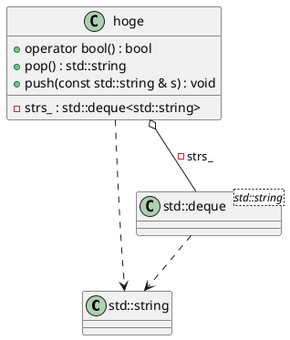
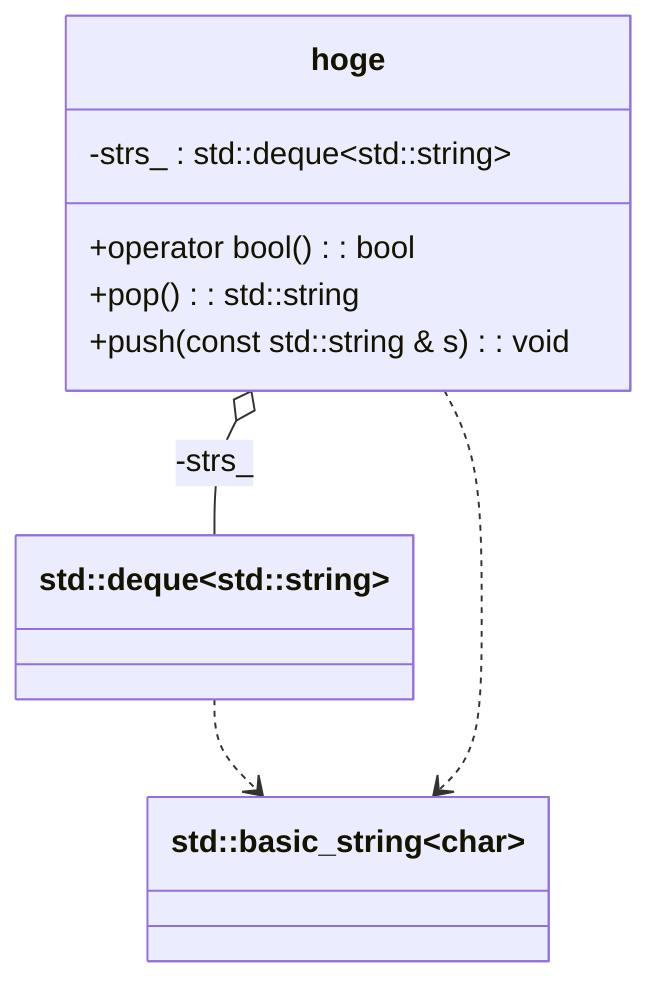

# 序

UMLって多分聞いたことない人が多いと思いますが、オブジェクト指向開発が流行って素晴らしいとされていた頃に、それまで分かれていたモデリング技法を統一したモデリング言語です。

https://ja.wikipedia.org/wiki/%E7%B5%B1%E4%B8%80%E3%83%A2%E3%83%87%E3%83%AA%E3%83%B3%E3%82%B0%E8%A8%80%E8%AA%9E

C++を使って新しいライブラリに触れるときなど、リバースしてUMLで見てみたいという機会がたまにあります。本格的なUMLを使ったツールでは [Enterprise Architect](https://en.wikipedia.org/wiki/Enterprise_Architect_(software)) のような市販の開発環境を使い、モデルとコードを1対1対応させ、コード生成とリバースをシームレスに行いながら開発を進めたりもしますが、今回紹介するのは、そういう本格的なモノではなく、もっとカジュアルなリバースエンジニアリングに特化したツールです。

https://github.com/bkryza/clang-uml

技術的にはclangの機能を使って解析したC++ソースからUMLのモデルを生成するツールになります。もちろん私は全く関与していないツールです。

# clang-uml

基本的にはビルド可能なソースコード群を用意して、それに対してUMLモデルを生成したい名前空間や出力形式を指定してコマンドラインから[plantuml](https://ja.wikipedia.org/wiki/PlantUML)/[mermaid](https://github.com/mermaid-js/mermaid)用のモデルファイルを生成します(モデルの元データとなるjson出力も可)。とりあえず使い方は一旦置いといて環境だけ作ります。

## dockerイメージ

公式イメージはありません。私が勝手に用意したものです。

```dockerfile
FROM ubuntu:22.04
RUN \
    --mount=type=cache,target=/var/lib/apt,sharing=locked \
    --mount=type=cache,target=/var/cache/apt,sharing=locked \
    apt-get update && \
    DEBIAN_FRONTEND=noninteractive TZ=Etc/UTC apt-get -y install tzdata \
    software-properties-common && \
    add-apt-repository ppa:bkryza/clang-uml && \
    apt update && \
    apt install -y clang-uml
RUN \    
    --mount=type=cache,target=/var/lib/apt,sharing=locked \
    --mount=type=cache,target=/var/cache/apt,sharing=locked \
    apt-get update && \
    DEBIAN_FRONTEND=noninteractive apt-get install -y make cmake python3-venv default-jre graphviz curl && \
    mkdir -p /opt/plantuml && \
    curl -L -o /opt/plantuml/plantuml.jar "$(curl -Ls -o /dev/null -w %{url_effective} 'https://github.com/plantuml/plantuml/releases/latest' | sed 's:/tag/:/download/:')/plantuml.jar" && \
    echo "#!/bin/sh\nexec java -Djava.awt.headless=true -jar /opt/plantuml/plantuml.jar \"\$@\"" >/usr/bin/plantuml && \
    chmod +x /usr/bin/plantuml
```
ubuntuにしてるのはppaでバイナリが用意されてるから。バージョンが22.04になってるのは、現在24.04を使うとインクルードファイルをうまく処理できなかったからです。最初のRUNで入れてるものが必須なモノで、2つ目のRUNで入れてるのがオプション的なツール類なので、要らなければ抜いて下さい。

含まれるもののライセンスは各自で調べて下さい。

https://ubuntu.com/legal/open-source-licences
https://launchpad.net/~bkryza/+archive/ubuntu/clang-uml
https://plantuml.com/ja/download

plantumlはデフォルトなのでGPLです。

### イメージのビルド
```console
docker build --progress=plain -t hoge:22.04 .
```

### 使い方

#### 準備

リバース対象となるサンプルソースコードを準備します。今回はtacコマンドのような動きをするC++ソースです。
```c++:hoge.cpp
#include <iostream>
#include <deque>

class hoge {
    std::deque<std::string> strs_;
public:
    operator bool() {return strs_.size() != 0;}
    void push(const std::string& s) {return strs_.push_back(s);}
    std::string pop() {
        std::string s = strs_.back();
        strs_.pop_back();
        return s;
    }
};

int main() {
    hoge rev;
    std::string line;
    while (std::getline(std::cin, line)) {
        rev.push(line);
    }
    while (rev) {
        std::cout << rev.pop() << std::endl;
    }
    return 0;
}
```
上記コードビルドのcmakeファイルです。
```cmake:CMakeLists.txt
cmake_minimum_required(VERSION 3.15.0)
project(hoge CXX)
add_executable(hoge hoge.cpp)
```

#### リバース実行

まずはビルドしたdockerイメージからコンテナを起動します。
```console
docker run -it --rm \
    -u $(id -u):$(id -g) \
    -v $(pwd):/home/ubuntu \
    -w /home/ubuntu \
    -e HOME=/home/ubuntu \
    -e TZ=Asia/Tokyo \
    hoge:22.04 bash
```

起動したら取り敢えずcmakeでビルドしてみます。

```console
CXX=clang++-15 cmake -DCMAKE_EXPORT_COMPILE_COMMANDS=ON -S . -B build
```
最初の`CXX=clang++-15`は使用するコンパイラの指定です。gccも入っていますが、リバース時に使用するのはclangなので、一応clangを指定しています。cmakeで普段見慣れない`-DCMAKE_EXPORT_COMPILE_COMMANDS=ON`という指定を使っていますが、これはコンパイルで使用したコマンドとオプションをjsonファイルに残すための設定です。clang-umlがあとでこのファイルを使うので一緒に生成しています。

ビルド出来たら実行してみます。

```console
$ ./build/hoge
1
2
3
(ここでCtrl+Dを入力します)
3
2
1
$
```
tacのような動きですね。

ビルドして動くようになったので、リバースしてみます。といってもバイナリからリバースするのではなく、ソースコードから静的解析するだけですけど。まずは初期化。

```console
$ clang-uml --init
$
```
デフォルトだと以下のようなファイルが生成されます。
```yaml:.clang-uml
# Change to directory where compile_commands.json is
compilation_database_dir: .
# Change to directory where diagram should be written
output_directory: docs/diagrams
diagrams:
  example_class_diagram:
    type: class
    glob:
      - src/*.cpp
    using_namespace:
      - myproject
    include:
      namespaces:
        - myproject
    exclude:
      namespaces:
        - myproject::detail
```
これをコンテナの外から編集して…(コンテナを起動したcwdをマウントしている)
```yaml:.clang-uml
compilation_database_dir: build
output_directory: docs/diagrams
diagrams:
  example_class_diagram:
    type: class
    glob:
      - ./hoge.cpp
```
※`compilation_database_dir`はcmakeの`-DCMAKE_EXPORT_COMPILE_COMMANDS=ON`で生成したファイルのあるディレクトリを指しています。

そしてリバース
```console
$ clang-uml 
[info] [tid 88] [cli_handler.cc:306] Loaded clang-uml config from .clang-uml
[info] [tid 88] [cli_handler.cc:333] Loading compilation database from /home/ubuntu/build directory
[info] [tid 90] [generators.h:367] Generating diagram example_class_diagram
[info] [tid 90] [generators.cc:112] Written example_class_diagram diagram to /home/ubuntu/docs/diagrams/example_class_diagram.puml
$
```

`/home/ubuntu/docs/diagrams/example_class_diagram.puml`にPlantUML用のクラス図が生成されたようです。

Qiitaのマークダウンでも直接表示できるので、生成されたファイルの内容をそのまま貼り付けて表示させています。PlantUMLについての詳細はこちら。

https://plantuml.com/ja/

次はmermaid用のファイルも生成してみます。

```console
$ clang-uml -g 2
[info] [tid 93] [cli_handler.cc:306] Loaded clang-uml config from .clang-uml
[info] [tid 93] [cli_handler.cc:333] Loading compilation database from /home/ubuntu/build directory
[info] [tid 95] [generators.h:367] Generating diagram example_class_diagram
[info] [tid 95] [generators.cc:112] Written example_class_diagram diagram to /home/ubuntu/docs/diagrams/example_class_diagram.mmd
$ 
```

生成ファイルは`/home/ubuntu/docs/diagrams/example_class_diagram.mmd`



似たような図が生成されました。こちらもQiitaのマークダウンで表示しています。Mermaidの詳細についてはコチラ。

https://mermaid.js.org/

#### PlantUMLかMermaidか？

PlantUMLを使用するかMermaidを使用するかは割と好みだと思います。

##### Mermaid

mermaidはJavaScriptなので、埋め込みに適しており、githubなど色々な場所で使えます。以下だけでも表示出来てしまいます。

```html
<script src=" https://cdn.jsdelivr.net/npm/mermaid@10.9.1/dist/mermaid.min.js "></script>
</script>
<!-- pre要素の中に.mmdの中身を貼り付ける -->
<pre class="mermaid">
</pre>
```

ただし、サイズに制限があるのである程度以上のテキストサイズになると、エラーで表示できなくなります。そんなときはCDNからロードした後、下記を実行することでこのテキストサイズの上限を増やす事ができます。
```html
<script>
mermaid.initialize({
  maxTextSize: XXXXXXXX
});
</script>
```

##### PlantUML

もちろんPlantUMLもWebなどOnlineで使用する場合はサイズに上限のある場合が多いです。ただし、今回はローカルで稼働させてsvg出力などもできるように環境を作ってあります。Webでサイズ制限しているのは主に攻撃されることを憂慮した結果でしょうし。

この環境では以下のようにsvgを生成することが出来ます。

```console
plantuml -svg /home/ubuntu/docs/diagrams/example_class_diagram.puml 
```

.pumlファイルと同じディレクトリに.svgが生成されます。

これを使うと割と大きなものでもエラーなく.svgが生成出来ます。なお、Mermaidでもsvgを生成したり出来ます。ただこの手の自動生成で生成される図の大きさは生成されるまでうかがい知れず、生成してみたら本当にバカでかい図だった、みたいなことも多いので、自分で調整する時間を考慮すると、速い方がいいかと思い、今回はPlantUMLの環境だけ入れています。

#### cmakeでないといけないのか？

そんなことはないです。ただし`-DCMAKE_EXPORT_COMPILE_COMMANDS=ON`で生成されるjsonファイルが別途必要になります。python3-venvを入れているのはコレのためです。

https://github.com/nickdiego/compiledb

## clang-umlの特徴

### コンパイラの静的解析を利用したモデル生成

昔からC++コードを静的に解析してUMLにするツールはいくつかありました。しかし、文脈依存な上にマクロやコマンドパラメータなどもあるC++の静的解析は古式ゆかしい単純な lex/yacc のような構造では辛く、動くコードなのに解析に失敗したり正しくないモデルになったりすることもよくありました。コンパイラだって大変な思いをして解析しているのですから、当たり前ですが。

その点clang-umlはclangというコンパイラ自体を使用した静的解析を使っており、完全なモデルを生成することができる、という利点があります。exampleを見れば分かるとおり、boostやら、pocoやら、割と有名なライブラリが解析されて載せられています(ただし小さいもののみ。それでも図にすると大きすぎますが)。従来のリバース方法では恐らくエラーだらけで使い物にならないでしょう。実際私もpocoで試してみましたが、ちゃんと解析できました(HTML上のmermaidではサイズの設定をしても理由の分からないエラーになって表示できませんでしたが)。

### 手作業で変更できないモデル自動生成

なお、範囲を限定していかに小さく分かりやすく1つの画像に納めるか、が自動生成系のツールの肝なのですが、このツールには名前空間やらクラスやらの範囲指定単位、include/excludeなどの指定方法など、基本的な指定はあって使えるようです。手動でレイアウト操作できるツールと比較すると、物足りない感じもありますが、及第点には達しているように思います。

### 細かい欠点

あとはドキュメントがあまり整備されておらず、初心者にはちょっと分かりにくいのが難点でしょうか。

# まとめ

- clang-umlを使うと、C++を静的解析し、UMLとして表示することが出来る
- 自動生成系なので、レイアウトなどはお察しだが、内容は信頼に値する

